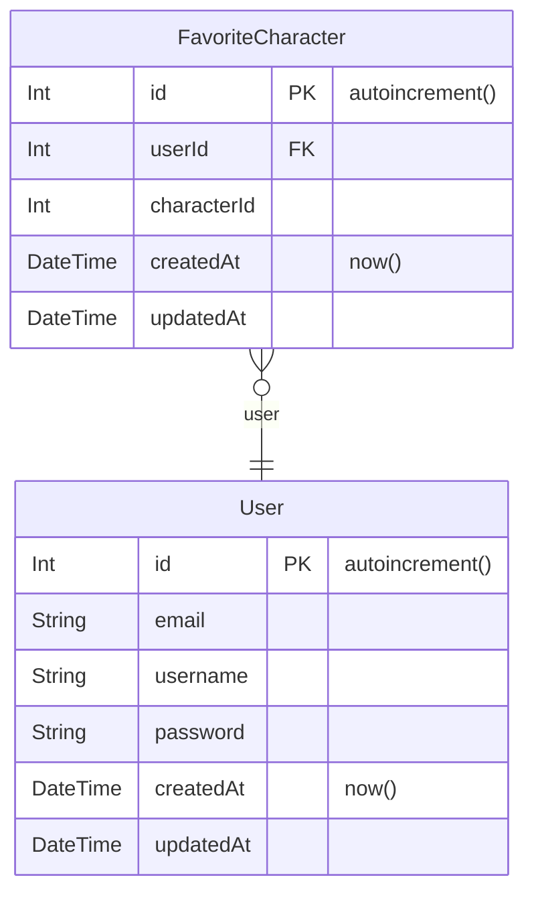

```mermaid
erDiagram
	User {
		Int id PK  "autoincrement()"
		String email
		String username
		String password
		DateTime createdAt  "now()"
		DateTime updatedAt
	}
	FavoriteCharacter {
		Int id PK  "autoincrement()"
		Int userId FK
		Int characterId
		DateTime createdAt  "now()"
		DateTime updatedAt
	}
	FavoriteCharacter }o--|| User : user

```
